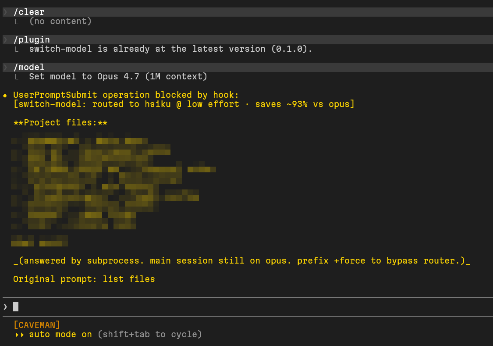
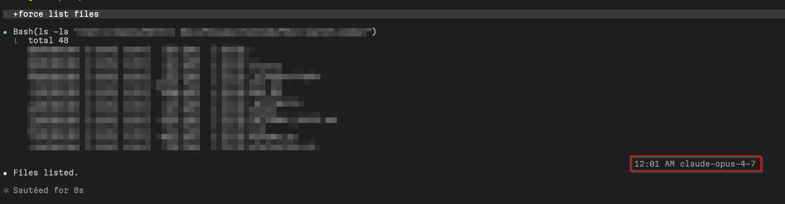

# switch-model

Automatic model routing for Claude Code. Every prompt gets sent to the cheapest model that can actually handle it. Opus stays reserved for the hard stuff.



---

## So what does this actually do?

You're running Claude Code on Opus or Sonnet all day. Renaming a file, listing values, looking something up -- none of that needs Opus. This plugin intercepts every prompt, picks the right tier (haiku / sonnet / opus), and if cheaper than your current model, runs it there via subprocess. Your session model never changes. The answer comes back inline with a note on what was saved.

```
[switch-model: routed to haiku @ low effort · saves ~93% vs opus]

2, 3, 5.

(answered by subprocess. main session still on opus. prefix +force to bypass router.)
```

---

## How does it decide which model to use?

Three tiers, matched by what you're asking:

| Tier | Prompt types |
|------|-------------|
| haiku | Rename, list, read, format, grep, factual lookups |
| sonnet | Implement, refactor, debug, test, write, edit (default) |
| opus | Design, architect, audit, security review, root cause, deep analysis |

Ambiguous prompts escalate to a haiku classifier call (~$0.0001, ~6s). Long prompts get bumped up a tier automatically.

It also reads your session transcript. Lots of recent errors? Routes higher. Long streak on one tier? Locks to it to stop flip-flopping.

---

## Ok, how do I install it?

**Try it first (one session only)**

```bash
claude --plugin-dir ~/path/to/switch-model
```

**Permanent install**

```bash
# 1. Clone the repo
git clone https://github.com/thebinarybot/switch-model ~/skills/switch-model

# 2. Register the marketplace
claude plugin marketplace add ~/skills

# 3. Install
claude plugin install switch-model@switch-model
```

Verify it's active:

```bash
claude plugin list
# should show: switch-model@switch-model  enabled
```

---

## How do I update it?

```bash
git -C ~/skills/switch-model pull
claude plugin update switch-model@switch-model
```

Want automatic updates at session start? Add `"autoUpdate": true` to the `switch-model` entry in `~/.claude/settings.json`:

```json
"extraKnownMarketplaces": {
  "switch-model": {
    "autoUpdate": true,
    "source": { "source": "directory", "path": "/home/you/skills" }
  }
}
```

---

## How do I remove it?

```bash
claude plugin uninstall switch-model@switch-model
```

That's it. The only thing left behind is `~/.cache/switch-model/` (router state), safe to delete.

---

## Can I tweak how it works?

Yes, via env vars:

| Variable | What it does |
|----------|-------------|
| `SWITCH_MODEL_NO_LLM=1` | Skip haiku classifier, use heuristics only (faster, less accurate) |
| `SWITCH_MODEL_NO_CONTEXT=1` | Skip transcript context analysis |
| `SWITCH_MODEL_NO_EFFORT=1` | Skip effort-level selection |
| `SWITCH_MODEL_DEBUG=1` | Print routing decisions to stderr for debugging |

---

## What if I want to skip the router for one prompt?

Prefix it with `+force`:

```
+force walk me through the full codebase
```

Router skips it entirely, your main session model handles it normally.



---

## Optional: statusline badge

Shows current model and last routing decision in your Claude Code status bar.

Add to `~/.claude/settings.json`:

```json
{
  "statusLine": {
    "type": "command",
    "command": "/home/you/skills/switch-model/statusline.sh"
  }
}
```

If you already have a statusline (caveman, etc.), you'll need to merge the outputs manually.

---

## Anything I should know before using it?

A few things worth knowing upfront:

- Routed answers don't enter your main session history. Follow-up questions won't have context from a routed reply.
- Routed prompts add 5 to 15 seconds of latency (subprocess spawn + optional classifier call).
- Subprocess token cost doesn't show in `/cost`. Check the Anthropic console for full spend.
- Heuristics miss edge cases sometimes. Use `+force` when they get it wrong.
